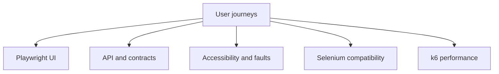

# QualityLab Automation

[](https://github.com/Monil1702/qualitylab-automation/actions/workflows/ci.yml)
[](https://playwright.dev/)
[](https://www.selenium.dev/)
[](LICENSE)

A portfolio-grade quality-engineering framework covering browser, API, contract, accessibility, resilience, performance, and legacy Selenium testing.

QualityLab includes its own deterministic commerce application. Tests therefore run without external credentials, changing third-party data, rate limits, or an unreliable public demo site.

## What this demonstrates

- Playwright with TypeScript, Page Objects, custom fixtures, and data-driven testing
- Chromium, Firefox, WebKit, and mobile-browser coverage
- REST API testing and JSON Schema contract validation
- WCAG accessibility scanning with axe-core
- Network fault injection and recoverable-state validation
- k6 load testing with explicit latency and error thresholds
- Java 17, Selenium WebDriver, JUnit 5, and Selenium Manager/Grid support
- Parallel execution, failure traces, screenshots, video, JUnit XML, and CI artifacts

## Coverage model



The repository emphasizes business risk instead of maximizing raw test count. See [docs/test-strategy.md](docs/test-strategy.md) for the risk-to-test mapping and exit criteria.

## Quick start

Prerequisites: Node.js 20+ and npm.

```bash
git clone https://github.com/Monil1702/qualitylab-automation.git
cd qualitylab-automation
npm ci
npx playwright install
npm test
```

Playwright automatically starts the local application at <http://127.0.0.1:3000> and stops it after the run.

Open the HTML report:

```bash
npm run report
```

## Useful commands

| Command               | Purpose                         |
| --------------------- | ------------------------------- |
| `npm test`            | Full Playwright matrix          |
| `npm run test:smoke`  | Critical-path tests             |
| `npm run test:api`    | API and schema-contract tests   |
| `npm run test:e2e`    | Browser journey tests           |
| `npm run test:a11y`   | axe accessibility checks        |
| `npm run test:headed` | Chromium with a visible browser |
| `npm run test:debug`  | Playwright Inspector            |
| `npm run typecheck`   | Strict TypeScript validation    |

## Test suites

### Browser journeys

- Successful and unsuccessful authentication
- Data-driven product search
- Cart and checkout workflow
- Out-of-stock behavior
- Responsive mobile smoke coverage

### API and contract tests

- Login and bearer-token authorization
- Product filtering
- Product JSON Schema validation with AJV
- Order creation and total calculation
- Unauthorized, invalid, and out-of-stock order scenarios

### Non-functional tests

- axe-core scans against WCAG 2 A/AA rules
- Intercepted product-service failure and user-facing recovery message
- k6 ramping load profile with `<1%` request failures and `<300 ms` p95 target

## Java Selenium suite

The smaller Java suite demonstrates Page Objects, JUnit 5, Selenium Manager, and optional Remote WebDriver support.

Start the application, then run:

```bash
npm run app
# In another terminal:
mvn --file selenium-java/pom.xml test
```

To use Selenium Grid:

```bash
docker compose up -d app selenium
BASE_URL=http://app:3000 \
SELENIUM_REMOTE_URL=http://localhost:4444/wd/hub \
mvn --file selenium-java/pom.xml test
```

Selenium Manager, bundled with Selenium, resolves compatible local drivers when no Grid URL is supplied.

## Performance test

Install [k6](https://grafana.com/docs/k6/latest/set-up/install-k6/), start the app, and run:

```bash
k6 run performance/orders.js
```

The included target is a local reference threshold, not a claim about production capacity. Record hardware, environment, and repeated-run results before putting performance metrics on a résumé.

## CI pipeline

GitHub Actions runs three independent quality gates:

1. Type checking, formatting, and the full Playwright browser matrix
2. Java Selenium tests against the locally hosted application
3. Docker Compose validation

Reports, traces, screenshots, videos, and JUnit XML are uploaded when the Playwright job completes, including on failure.

## Project structure

```text
app/                 deterministic Express application and API
tests/api/           service and JSON contract tests
tests/e2e/           cross-browser user journeys
tests/accessibility/ axe WCAG scans
tests/resilience/    controlled network-failure tests
tests/pages/         Page Object classes
tests/fixtures/      typed Playwright fixtures
performance/         k6 workload
selenium-java/       Java 17 + JUnit 5 WebDriver suite
docs/                risk-based test strategy
```

## Design decisions

- **Self-hosted fixture:** removes public-site flakiness and makes negative-path testing safe.
- **Semantic locators:** tests use roles and labels to improve resilience and accessibility alignment.
- **API-heavy assertions:** business-rule tests run below the UI when browser rendering is not part of the risk.
- **Two browser frameworks:** Playwright is the primary modern suite; Selenium shows compatibility with common enterprise test estates.
- **Failure evidence:** traces and media are created only when useful, keeping normal CI runs lean.

## License

MIT
